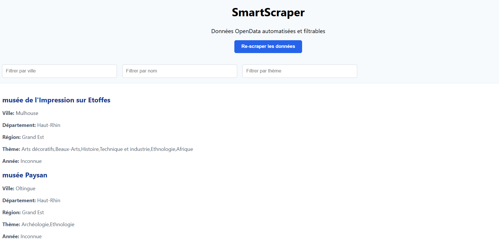
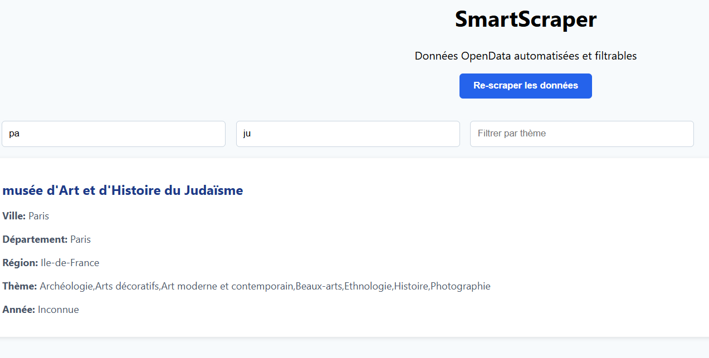

# 🧠 SmartScraper – Collecte et visualisation de données Open Data

## 🎯 Objectif du projet

SmartScraper est une application web fullstack conçue pour :

- Collecter automatiquement des données depuis une source open data légale (CSV ou API),
- Les insérer dans une base de données relationnelle (SQLite),
- Les exposer via une API REST construite avec **Flask**,
- Les afficher de manière dynamique et filtrable avec une interface **React**,
- Et enfin conteneuriser l’ensemble avec **Docker** et `docker-compose`.

---

## 🧰 Technologies utilisées

| Composant         | Stack technique                         |
|-------------------|------------------------------------------|
| Backend API       | Python 3 + Flask + SQLAlchemy            |
| Scraper           | Python (pandas + requests)               |
| Base de données   | SQLite (fichier local `annonces.db`)     |
| Frontend Web      | React.js + TailwindCSS                   |
| Conteneurisation  | Docker + docker-compose                  |

---

## 🌐 Source de données utilisée

**Nom** : Musées de France – Base MUSEOFILE  
**URL** : https://www.data.gouv.fr/fr/datasets/musees-de-france-base-museofile/  

---

## 📜 Licence des données

**Licence Ouverte / Open Licence (Etalab)**

> "Les données diffusées sur data.gouv.fr sont librement réutilisables dans les conditions fixées par la Licence Ouverte."


## 📁 Arborescence du projet

smart-scrapper-MatteoDylanBrassica/
smartcraper/
├── backend/
│   ├── app.py
│   ├── db.py
│   ├── models.py
│   ├── scraper.py
│   |── requirements.txt
│   ├── musees_data.json
│   |── musees.db
│   ├── test_scraper.py
│   
├── frontend/
│   ├── public/
│   │   └── index.html
│   ├── src/
│   │   ├── App.js
│   │   ├── components/
│   │   │   ├── CardGrid.js
│   │   │   ├── DataTable.js
│   │   │   └── Filters.js
│   │   └── index.js
│   └── package.json
├── docker/
│   ├── Dockerfile.backend
│   ├── Dockerfile.frontend
│   └── docker-compose.yml
├── musees.db
├── musees_data.json
└── README.md


---

## ⚙️ Procédure d’installation (via Docker)

1. **Se positionner à la racine du projet** :
   ```bash
   cd smartscraper
   cd docker
   docker-compose up --build
   ```

# Voici les routes

- API Flask : http://localhost:3000/
- Frontend React : http://localhost:5000/api/data

- http://localhost:5000/api/data/{Ville}
- http://localhost:5000//api/data/nom/{nom}.


## 🖼️ Aperçu de l'application

### Page d'accueil


### Exemple de filtre





👨‍💻 Équipe projet
Étudiants : Brassica Selvaratnam, Dylan Bouiullon, Matteo Guy

